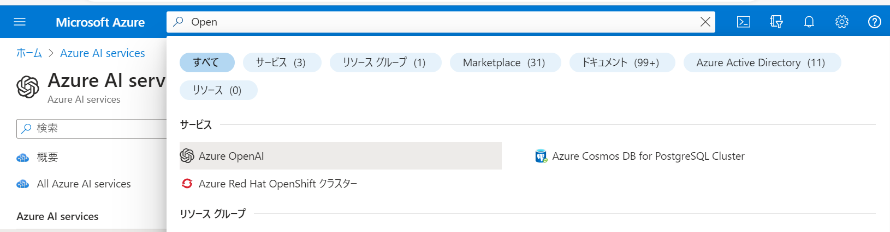
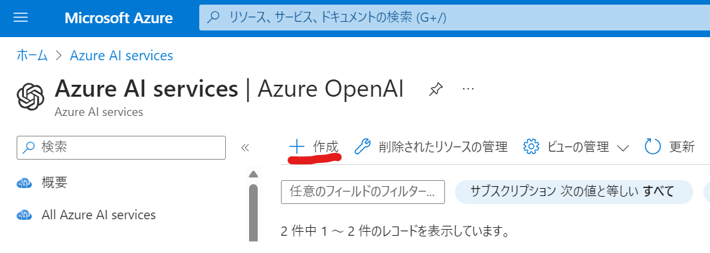
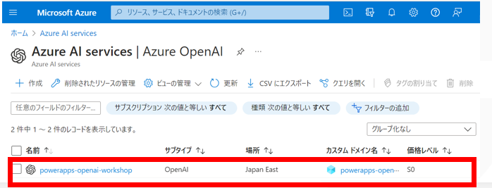
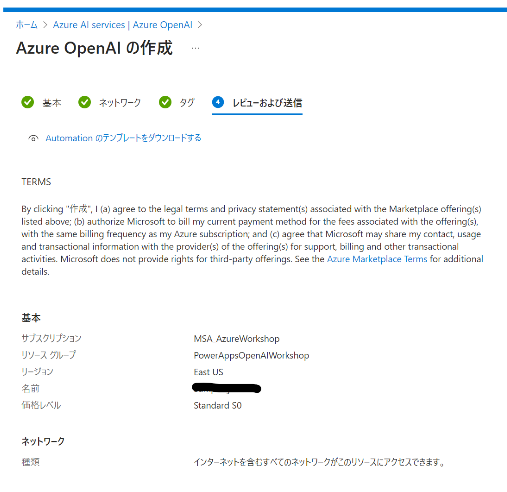
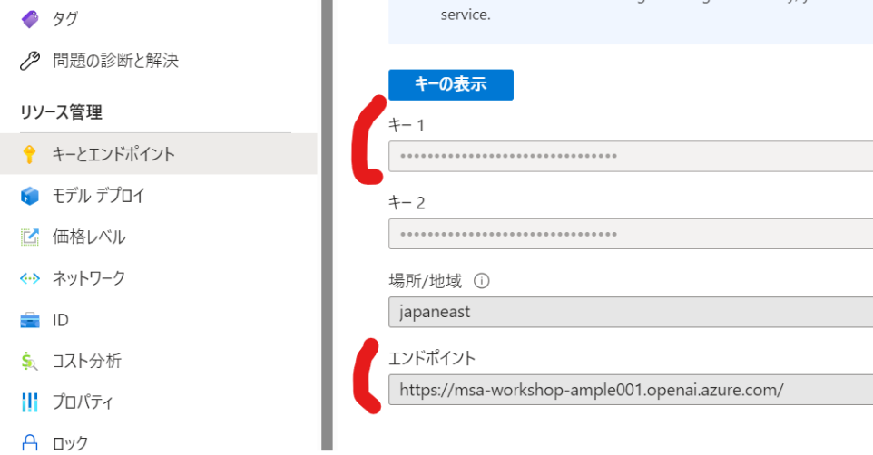

## POWER APP

### Prerequiste

#### Open AI リソースの作成

以下の手順でAzure PortalからOpen AIリソースの作成を実施してください。

> 今回はワークショップ用にサブスクリプション「MSA_Workshop」を払い出しています。サブスクリプションが割り当たっていないという方は、Iijima Koki, Enomoto, Masahiroへお声掛けください。

Azure Portalへサインインし、検索窓からOpen AIを検索



「作成」をクリック



サブスクリプション「MSA_AzureWorkshop」を選択



以下の内容で作成をクリック



リソースの作成が完了すると、キーとエンドポイントが発行されます。こちらの情報は後ほど使いますのでメモするようにしてください。




### Step 1. Sign in to Power Apps

- You can sign in to power apps with your existing licence or you can sign up for free - https://powerapps.microsoft.com/


### Step 2. Deploy client Power App

- click on Apps on the left navigation. 

  


- From the top nav bar, click Import Canvas App and upload the power app zip file from this git repo path. 

[OpenAIPlayground-JBSWorkshop_20230808045544.zip](https://github.com/KokiIijima24/OpenAIWorkshop/blob/main/scenarios/powerapp_and_python/powerapp/OpenAIPlayground-JBSWorkshop_20230808045544.zip)

  


  


- Click on Import to import the package into powerapps environment. 


  


- This will import the Power App canvas app and the Power Automate Flow into the workspace. 


  


- Click on the flows and edit the Power Automate Flow

  


- Edit the Power Automate Flow HTTP step with your own Azure OpenAI API [key and endpoint](https://learn.microsoft.com/en-us/azure/cognitive-services/openai/quickstart?pivots=rest-api#retrieve-key-and-endpoint)


  

Bodyの中身を以下のように書き換えてください。

```
{
  "messages": [
    {
      "role": "system",
      "content": "You are an AI assistant that helps people find information."
    },
    {
      "role": "user",
      "content": @{triggerBody()['Initializevariable_Value']}
    }
  ],
  "max_tokens": 800,
  "temperature": 0.7,
  "frequency_penalty": 0,
  "presence_penalty": 0,
  "top_p": 0.95,
  "stop": null
}
```

また、api-keyを取得して、設定してください。

- Save the flow and make sure that flow is turned on


### Step 2. Test

- run the App by clicking on the App

  
