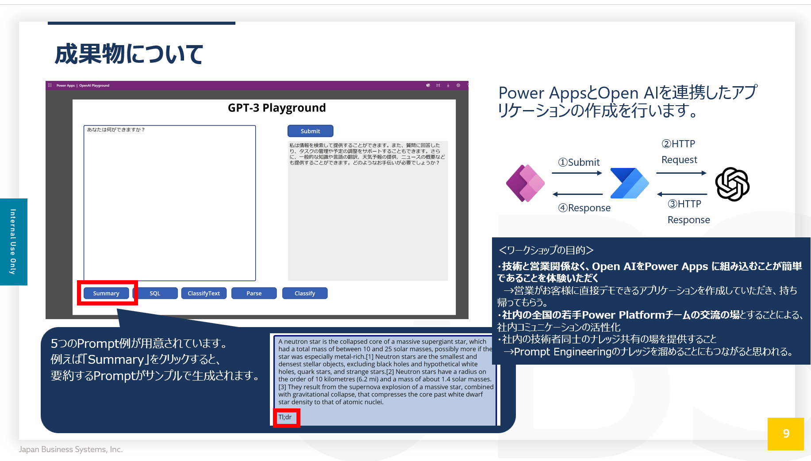
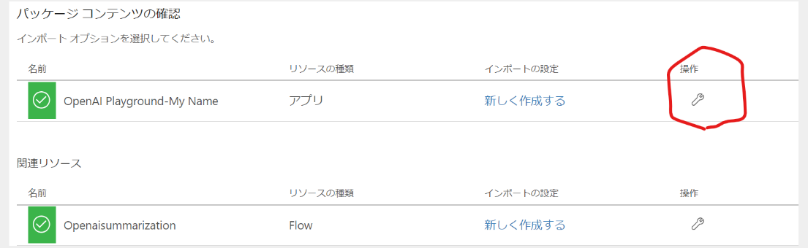

## POWER APP

今回、JBS社内でワークショップを実施するため、[microsoft - OpenAIWorkshop](https://github.com/microsoft/OpenAIWorkshop)のリポジトリをForkしたものを展開しています。

### Prerequiste

Power AppsをOpen AIのインターフェースとする簡単なアプリケーションを作成します。

  


#### Open AI リソースの作成

以下の手順でAzure PortalからOpen AIリソースの作成を実施してください。

> 今回はワークショップ用にサブスクリプション「MSA_Workshop」を払い出しています。サブスクリプションが割り当たっていないという方は、koki, iijimaへお声掛けください。

Azure Portalへサインインし、検索窓からOpen AIを検索

  


作成済のOpen AIリソースを選択します。
今回、皆様には「Cognitive Services OpenAI 共同作成者」のロールを割り当てているのですが、Open AIの場合は、共同作成者の権限があっても、新規リソースが作成できないとのことで予め作成したものを利用していただきます。

参考：[Azure OpenAI Service のロールベースのアクセス制御](https://learn.microsoft.com/ja-jp/azure/ai-services/openai/how-to/role-based-access-control)

  


リソースの作成が完了すると、キーとエンドポイントが発行されます。こちらの情報は後ほど使いますのでメモするようにしてください。

※キー情報は皆様から見れないため、チャットで共有します

  


### Step 1. Sign in to Power Apps

- You can sign in to power apps with your existing licence or you can sign up for free - https://powerapps.microsoft.com/


### Step 2. Deploy client Power App

- click on Apps on the left navigation. 

  


- From the top nav bar, click Import Canvas App and upload the power app zip file from this git repo path. 

  [OpenAI-Playground_20230302010547.zip](https://github.com/KokiIijima24/OpenAIWorkshop/blob/main/scenarios/powerapp_and_python/powerapp/OpenAIPlayground-JBSWorkshop_20230808082726.zip)

  


  


  


- Click on Import to import the package into powerapps environment. 

他の人とリソース名が被らないように、赤丸で囲った編集ボタンからリソース名を編集してください。

  


- This will import the Power App canvas app and the Power Automate Flow into the workspace. 


  


- Click on the flows and edit the Power Automate Flow

  


- Edit the Power Automate Flow HTTP step with your own Azure OpenAI API [key and endpoint](https://learn.microsoft.com/en-us/azure/cognitive-services/openai/quickstart?pivots=rest-api#retrieve-key-and-endpoint)


  

Bodyの中身を以下のように書き換えてください。

```
{
  "messages": [
    {
      "role": "system",
      "content": "You are an AI assistant that helps people find information."
    },
    {
      "role": "user",
      "content": @{triggerBody()['Initializevariable_Value']}
    }
  ],
  "max_tokens": 800,
  "temperature": 0.7,
  "frequency_penalty": 0,
  "presence_penalty": 0,
  "top_p": 0.95,
  "stop": null
}
```

また、api-keyを取得して、設定してください。

- Save the flow and make sure that flow is turned on


### Step 2. Test

- run the App by clicking on the App

  
